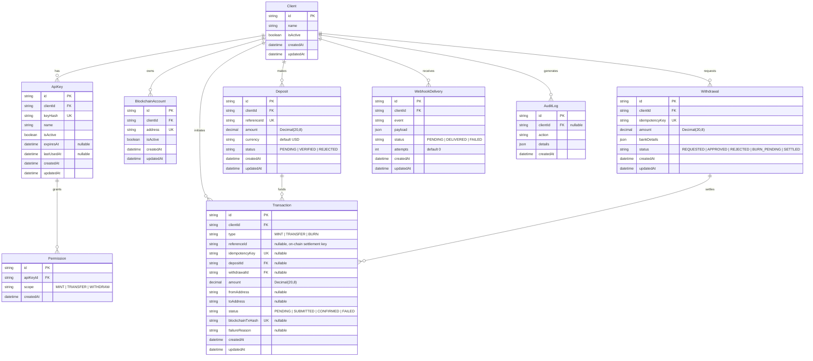

# VittaGems Settlement — PostgreSQL Data Model

Source of truth: [`prisma/schema.prisma`](../prisma/schema.prisma)
Datasource: PostgreSQL (`DATABASE_URL`)
ID strategy: every table uses a `uuid` string primary key (`@default(uuid())`).
Money: all amounts are `Decimal(20, 8)` (`@db.Decimal(20, 8)`).
Timestamps: `createdAt` defaults to `now()`; `updatedAt` is maintained by Prisma (`@updatedAt`).

---

## 1. Entity–Relationship Diagram

---

## 2. Relationship Summary

| Parent | Child | Cardinality | FK column | On child delete | Optional? |
|--------|-------|-------------|-----------|-----------------|-----------|
| Client | ApiKey | 1 → N | `ApiKey.clientId` | — | required |
| Client | BlockchainAccount | 1 → N | `BlockchainAccount.clientId` | — | required |
| Client | Deposit | 1 → N | `Deposit.clientId` | — | required |
| Client | Withdrawal | 1 → N | `Withdrawal.clientId` | — | required |
| Client | Transaction | 1 → N | `Transaction.clientId` | — | required |
| Client | WebhookDelivery | 1 → N | `WebhookDelivery.clientId` | — | required |
| Client | AuditLog | 1 → N | `AuditLog.clientId` | — | **nullable** (system events) |
| ApiKey | Permission | 1 → N | `Permission.apiKeyId` | — | required |
| Deposit | Transaction | 1 → N | `Transaction.depositId` | — | **nullable** (only MINT flows) |
| Withdrawal | Transaction | 1 → N | `Transaction.withdrawalId` | — | **nullable** (only BURN flows) |

> Referential actions are not declared in the schema, so Prisma applies its defaults:
> `onDelete: Restrict` (or `SetNull` for nullable relations) and `onUpdate: Cascade`.

---

## 3. Table Reference

### 3.1 `Client`
The tenant / customer integrating with the settlement service. Root of every other record.

| Column | Type | Constraints | Notes |
|--------|------|-------------|-------|
| `id` | `String` | PK, `uuid` | |
| `name` | `String` | required | Display name of the client. |
| `isActive` | `Boolean` | default `true` | Soft on/off switch for the whole tenant. |
| `createdAt` | `DateTime` | default `now()` | |
| `updatedAt` | `DateTime` | `@updatedAt` | |

Back-relations: `ApiKeys`, `BlockchainAccounts`, `Transactions`, `Deposits`, `Withdrawals`, `WebhookDeliveries`, `AuditLogs`.

---

### 3.2 `ApiKey`
Credential a client uses to authenticate API calls. Only the hash is stored.

| Column | Type | Constraints | Notes |
|--------|------|-------------|-------|
| `id` | `String` | PK, `uuid` | |
| `clientId` | `String` | FK → `Client.id` | |
| `keyHash` | `String` | **unique** | Hash of the raw API key; raw value never persisted. |
| `name` | `String` | required | Human label for the key. |
| `isActive` | `Boolean` | default `true` | Allows revocation without deletion. |
| `expiresAt` | `DateTime?` | nullable | Null = no expiry. |
| `lastUsedAt` | `DateTime?` | nullable | Updated on each authenticated request. |
| `createdAt` | `DateTime` | default `now()` | |
| `updatedAt` | `DateTime` | `@updatedAt` | |

Back-relation: `Permissions`.

---

### 3.3 `Permission`
A single scope granted to an API key. One row per scope (not a bitmask).

| Column | Type | Constraints | Notes |
|--------|------|-------------|-------|
| `id` | `String` | PK, `uuid` | |
| `apiKeyId` | `String` | FK → `ApiKey.id` | |
| `scope` | `String` | required | Enum-by-convention: `MINT`, `TRANSFER`, `WITHDRAW`. |
| `createdAt` | `DateTime` | default `now()` | No `updatedAt` — rows are immutable. |

---

### 3.4 `BlockchainAccount`
An on-chain address owned by a client (source/target for settlement movements).

| Column | Type | Constraints | Notes |
|--------|------|-------------|-------|
| `id` | `String` | PK, `uuid` | |
| `clientId` | `String` | FK → `Client.id` | |
| `address` | `String` | **unique** | On-chain account address. |
| `isActive` | `Boolean` | default `true` | |
| `createdAt` | `DateTime` | default `now()` | |
| `updatedAt` | `DateTime` | `@updatedAt` | |

---

### 3.5 `Deposit`
Fiat funds received from a client, pending verification before minting.

| Column | Type | Constraints | Notes |
|--------|------|-------------|-------|
| `id` | `String` | PK, `uuid` | |
| `clientId` | `String` | FK → `Client.id` | |
| `referenceId` | `String` | **unique** | External deposit reference; dedupe key. |
| `amount` | `Decimal(20,8)` | required | |
| `currency` | `String` | default `"USD"` | |
| `status` | `String` | required | `PENDING`, `VERIFIED`, `REJECTED`. |
| `createdAt` | `DateTime` | default `now()` | |
| `updatedAt` | `DateTime` | `@updatedAt` | |

Back-relation: `Transactions` (the MINT settlement legs funded by this deposit).

---

### 3.6 `Withdrawal`
Client request to redeem tokens for fiat. Drives the BURN + payout flow.

| Column | Type | Constraints | Notes |
|--------|------|-------------|-------|
| `id` | `String` | PK, `uuid` | |
| `clientId` | `String` | FK → `Client.id` | |
| `idempotencyKey` | `String` | **unique** | Caller-supplied; guarantees one withdrawal per key. |
| `amount` | `Decimal(20,8)` | required | |
| `bankDetails` | `Json` | required | Payout bank account payload. |
| `status` | `String` | required | `REQUESTED`, `APPROVED`, `REJECTED`, `BURN_PENDING`, `SETTLED`. |
| `createdAt` | `DateTime` | default `now()` | |
| `updatedAt` | `DateTime` | `@updatedAt` | |

Back-relation: `Transactions` (the BURN settlement leg for this withdrawal).

---

### 3.7 `Transaction`
The settlement ledger entry. One row per on-chain settlement action (MINT / TRANSFER / BURN).

| Column | Type | Constraints | Notes |
|--------|------|-------------|-------|
| `id` | `String` | PK, `uuid` | |
| `clientId` | `String` | FK → `Client.id` | |
| `type` | `String` | required | `MINT`, `TRANSFER`, `BURN`. |
| `referenceId` | `String?` | nullable | On-chain settlement reference — key into the `VittaGemsSettlement` contract. |
| `idempotencyKey` | `String?` | **unique**, nullable | Dedup key for the initiating API call. |
| `depositId` | `String?` | FK → `Deposit.id`, nullable | Set for MINT flows. |
| `withdrawalId` | `String?` | FK → `Withdrawal.id`, nullable | Set for BURN flows. |
| `amount` | `Decimal(20,8)` | required | |
| `fromAddress` | `String?` | nullable | Source address (TRANSFER / BURN). |
| `toAddress` | `String?` | nullable | Target address (MINT / TRANSFER). |
| `status` | `String` | required | `PENDING`, `SUBMITTED`, `CONFIRMED`, `FAILED`. |
| `blockchainTxHash` | `String?` | **unique**, nullable | On-chain tx hash once submitted. |
| `failureReason` | `String?` | nullable | Populated when `status = FAILED`. |
| `createdAt` | `DateTime` | default `now()` | |
| `updatedAt` | `DateTime` | `@updatedAt` | |

---

### 3.8 `WebhookDelivery`
Outbound event notification to a client endpoint, with retry accounting.

| Column | Type | Constraints | Notes |
|--------|------|-------------|-------|
| `id` | `String` | PK, `uuid` | |
| `clientId` | `String` | FK → `Client.id` | |
| `event` | `String` | required | Event name (e.g. `deposit.verified`, `transaction.confirmed`). |
| `payload` | `Json` | required | Full event body sent to the client. |
| `status` | `String` | required | `PENDING`, `DELIVERED`, `FAILED`. |
| `attempts` | `Int` | default `0` | Incremented per delivery attempt. |
| `createdAt` | `DateTime` | default `now()` | |
| `updatedAt` | `DateTime` | `@updatedAt` | |

---

### 3.9 `AuditLog`
Append-only record of security- and settlement-relevant actions.

| Column | Type | Constraints | Notes |
|--------|------|-------------|-------|
| `id` | `String` | PK, `uuid` | |
| `clientId` | `String?` | FK → `Client.id`, nullable | Null for system-level events with no client context. |
| `action` | `String` | required | Action identifier. |
| `details` | `Json` | required | Structured context for the action. |
| `createdAt` | `DateTime` | default `now()` | No `updatedAt` — rows are immutable. |

---

## 4. Status Value Reference (string enums by convention)

| Model | Field | Allowed values |
|-------|-------|----------------|
| `Permission` | `scope` | `MINT`, `TRANSFER`, `WITHDRAW` |
| `Deposit` | `status` | `PENDING`, `VERIFIED`, `REJECTED` |
| `Withdrawal` | `status` | `REQUESTED`, `APPROVED`, `REJECTED`, `BURN_PENDING`, `SETTLED` |
| `Transaction` | `type` | `MINT`, `TRANSFER`, `BURN` |
| `Transaction` | `status` | `PENDING`, `SUBMITTED`, `CONFIRMED`, `FAILED` |
| `WebhookDelivery` | `status` | `PENDING`, `DELIVERED`, `FAILED` |

> These are stored as plain `String` columns — not PostgreSQL `enum` types — so validation is enforced in application code, not the database.

---

## 5. Unique Constraints & Indexes

| Table | Column(s) | Kind | Purpose |
|-------|-----------|------|---------|
| `ApiKey` | `keyHash` | unique | Credential lookup + collision guard. |
| `BlockchainAccount` | `address` | unique | One record per on-chain address. |
| `Deposit` | `referenceId` | unique | Idempotent deposit ingestion. |
| `Withdrawal` | `idempotencyKey` | unique | Idempotent withdrawal creation. |
| `Transaction` | `idempotencyKey` | unique | Idempotent settlement initiation. |
| `Transaction` | `blockchainTxHash` | unique | One ledger row per on-chain tx. |

FK columns (`clientId`, `apiKeyId`, `depositId`, `withdrawalId`) are **not** explicitly indexed in the schema. Prisma/PostgreSQL do not auto-create FK indexes, so consider adding `@@index([clientId])` on the high-volume tables (`Transaction`, `Deposit`, `Withdrawal`, `WebhookDelivery`, `AuditLog`) before production load.

---

## 6. Typical Flows

**Mint (deposit → tokens):**
`Deposit` created (`PENDING`) → verified (`VERIFIED`) → `Transaction` (`type = MINT`, `depositId` set) created (`PENDING`) → submitted on-chain (`SUBMITTED`, `blockchainTxHash` set) → `CONFIRMED` → `WebhookDelivery` emitted.

**Withdraw (tokens → fiat):**
`Withdrawal` created (`REQUESTED`) → `APPROVED` → `Transaction` (`type = BURN`, `withdrawalId` set) → burn `CONFIRMED` → `Withdrawal` moves `BURN_PENDING` → `SETTLED` after fiat payout → `WebhookDelivery` emitted.

**Transfer:**
`Transaction` (`type = TRANSFER`, `fromAddress` + `toAddress` set, no deposit/withdrawal link) → `SUBMITTED` → `CONFIRMED`.

Every state change of note is mirrored into `AuditLog`.
