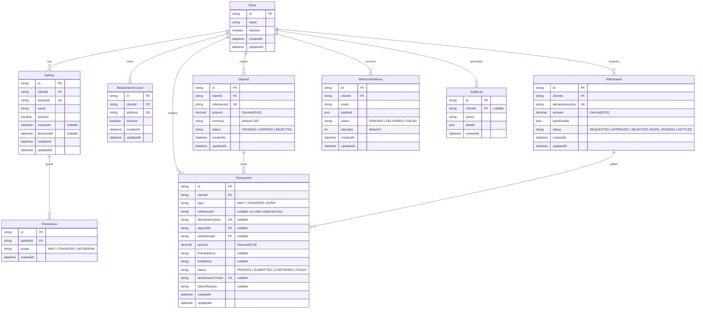

# VittaGems Settlement — ER Diagram

Standalone entity–relationship diagram for the PostgreSQL schema
([`prisma/schema.prisma`](../prisma/schema.prisma)).
Full column/constraint reference: [`DATA_MODEL.md`](./DATA_MODEL.md).
Raw Mermaid source: [`er-diagram.mmd`](./er-diagram.mmd).

## Relationships at a glance

| From | To | Cardinality | Via |
|------|----|-------------|-----|
| Client | ApiKey | 1 → N | `ApiKey.clientId` |
| Client | BlockchainAccount | 1 → N | `BlockchainAccount.clientId` |
| Client | Deposit | 1 → N | `Deposit.clientId` |
| Client | Withdrawal | 1 → N | `Withdrawal.clientId` |
| Client | Transaction | 1 → N | `Transaction.clientId` |
| Client | WebhookDelivery | 1 → N | `WebhookDelivery.clientId` |
| Client | AuditLog | 1 → N (nullable) | `AuditLog.clientId` |
| ApiKey | Permission | 1 → N | `Permission.apiKeyId` |
| Deposit | Transaction | 1 → N (nullable) | `Transaction.depositId` |
| Withdrawal | Transaction | 1 → N (nullable) | `Transaction.withdrawalId` |
